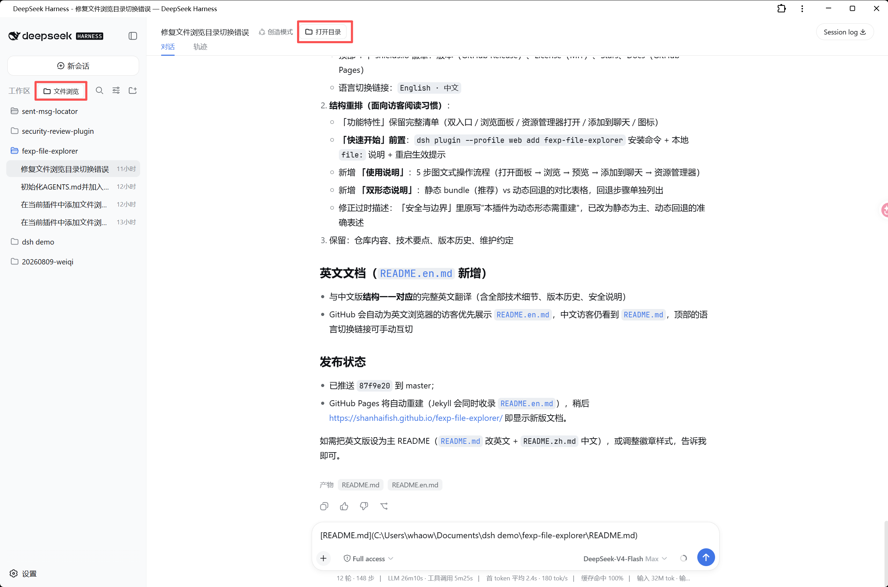
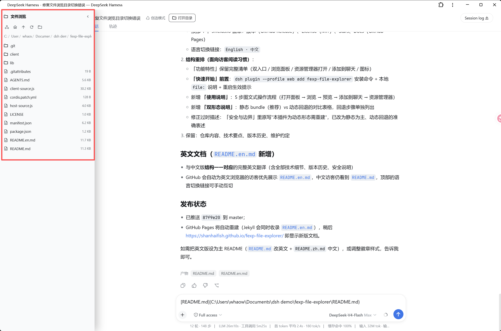
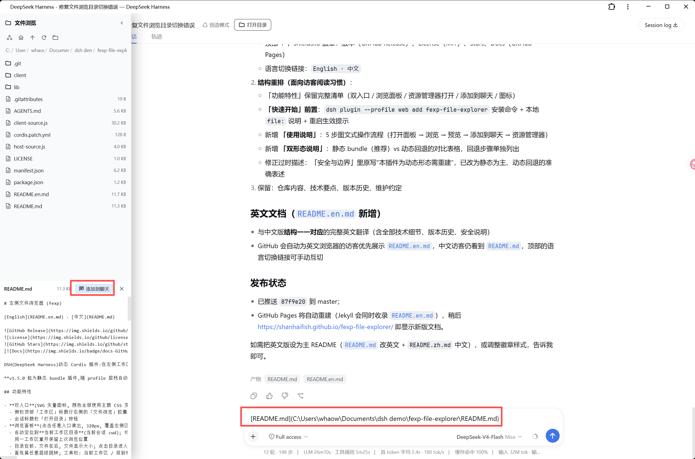

# Workspace File Explorer (fexp)

[English](README.en.md) · [中文](README.md)


[](https://shanhaifish.github.io/fexp-file-explorer/)

A dynamic Cordis plugin for DSH (DeepSeek Harness) that browses workspace directories and files from the left sidebar. Two entry points — the "File Explorer" pill at the top of the sidebar and the "Open Directory" button in the session header — slide out a 320px panel that locates the current workspace directory. Click a directory to enter it, click a file to preview its text content. The toolbar can open the current directory in the system file explorer with one click, and file references can be appended to the chat input while previewing.

**Since v1.5.0 this is a static bundle plugin loaded automatically from the profile layer stack** — install once, and it activates on every DSH startup with no manual `define`/`run` needed.

## Features

- **Dual entry points** (SVG vector icons; colors use theme CSS variables, so text stays readable on light, dark, and any custom theme):
  - "File Explorer" pill button at the top of the sidebar, right of the "Workspaces" title (shown when the sidebar is wide; auto-hidden while the "Search sessions" box is expanded so it never covers the search input, v1.5.1)
  - "Open Directory" button in the session header bar
- **Browse panel** (slides out from either entry, 320px, overlays the left area):
  - Automatically locates the **current workspace directory** (current session `cwd`); re-locates automatically when you switch workspaces, while re-opening in the same workspace keeps your last position
  - Directories first, then files (with sizes); click a directory to enter, click a file to preview
  - Breadcrumb navigation at any level; toolbar: current workspace / root / up one level / refresh / **open in system file explorer**
  - File preview: text content (256KB default limit, 1MB max), with clear messages for binary or oversized files
  - Preview header: file name / size / **[Add to chat]** / close preview
- **Open in system file explorer**: one click opens the current directory in the OS file manager (DSH native `host.openPath`, `Invoke-Item` on Windows)
- **Add to chat**: appends a file reference `[file name](absolute path)` to the chat input draft (without overwriting existing content); supports adding multiple files in a row
- **Icons (v1.4.0)**: Google Material Icons official library (fonts.google.com/icons, Apache 2.0), solid fill style stays crisp at small sizes, consistent with Chrome/Android first-party visuals

## Screenshots

| | | |
| --- | --- | --- |
|  |  |  |

## Quick Start

```sh
# Install (static bundle, recommended)
dsh plugin --profile web add github:ShanHaiFish/fexp-file-explorer
```

For local development use `file:` pointing at this repository (the path must NOT contain spaces):

```sh
dsh plugin --profile web add file:/path/to/fexp-file-explorer
```

Restart `dsh web` and the plugin activates automatically: the "File Explorer" pill appears at the top of the sidebar and the "Open Directory" button appears in the session header. No manual `define`/`run` required.

## Usage

1. **Open the panel**: click "File Explorer" in the sidebar or "Open Directory" in the session header; the 320px panel slides out from the left, locating the current workspace directory;
2. **Browse**: click a directory to enter it; use the toolbar "up one level / root / refresh" or jump to any level via the breadcrumbs;
3. **Preview files**: click a file to preview its text content at the bottom of the panel (256KB default limit);
4. **Add to chat**: while previewing, click "Add to chat" to append `[file name](absolute path)` to the input draft, then edit and send;
5. **Open in system file explorer**: the rightmost toolbar button opens the current directory in the OS file manager (`Invoke-Item` on Windows).

## Repository Contents

| Path | Description |
| --- | --- |
| `package.json` + `cordis.patch.yml` + `lib/` + `client/` | **Static bundle** (recommended): auto-loaded on DSH startup after `dsh plugin add` |
| `host-source.js` + `client-source.js` | Dynamic-plugin fallback form: for profiles without bundle support |
| `manifest.json` | Plugin metadata + restore parameters (plugin/name/purpose/version) |
| `LICENSE` | MIT License |
| `assets/` | UI screenshots (screenshot-1~3.png) |
| `AGENTS.md` | Agent collaboration conventions (rebuild flow / change workflow / coding conventions / versioning) |
| `README.md` / `README.en.md` | 中文 / English docs |

## Two Forms

| | Static bundle (v1.5.0, recommended) | Dynamic plugin (fallback) |
| --- | --- | --- |
| Loading | `dsh plugin add` installs into the profile layer stack; auto-loaded on DSH startup | Must be re-registered with `cordis_define` + `cordis_run` after every DSH restart |
| Code | `lib/index.js` (Host) + `client/client.js` (Client) | `host-source.js` + `client-source.js` |
| When to use | Normal profiles (web, etc.) | Profiles without bundle support |

Dynamic fallback steps:

1. Have an agent read `host-source.js` and `client-source.js`;
2. `cordis_define`: `plugin: { kind: "new", idPrefix: "fexp" }`, `name`/`purpose` from `manifest.json` (purpose includes the `CAPABILITIES: fs, rpc` declaration), `code.host`/`code.client` as the full contents of the two source files;
3. `cordis_run` to activate; success when the panel appears.

> The dynamic form does not survive DSH restarts and must be reloaded; the static bundle form has no such limitation.

## Technical Notes

- **Host half**: the static bundle form lives in `lib/index.js` and mounts three JSON routes via `webServer` (`/fexp/default-root`, `/fexp/list-dir`, `/fexp/read-file`) on top of the DSH `fs` service (resolve/listDir/stat/readText) and `sandboxPolicy.workspaceRoot`; the dynamic fallback in `host-source.js` exposes the same three methods as Package-private RPCs via `harness.handle`.
- **Client half**: uses only additive slots (`shell.overlay`, `conversation.session.header.actions`, `conversation.input.dock`, `sidebar.footer.action`) and never replaces built-in UI; plain JS + `React.createElement`, no JSX/TS. The static form registers via `window.__ModuleLoader__.load`, replaces `host.call` with fetches to same-origin routes, and replaces `styles.insert` with a self-managed `<style>` tag.
- **Startup race fix (v1.0.0)**: `useStore` self-heals by re-reading state right after subscribing, so a probe update landing before the subscription is never lost; `sidebarWide` defaults to `true` so the top button stays visible even if the probe fails.
- **Open in explorer (v1.1.0/1.5.2)**: the path goes to DSH native `host.openPath` (`Invoke-Item` on Windows). Since v1.5.2 it calls the native API directly (`POST /api/host.openPath`, the official client-request envelope protocol, same-origin) — intercepting plugins like `dsh-better-sidebar` monkey-patch `workspaces.openPath` and reroute "open directory" into "open file in the sidebar editor", which rejects directories with `"…" is a directory`; direct calls bypass the patched channel, falling back to `workspaces.openPath` when fetch is unavailable or the network layer fails; no new Host RPC, no spawn/external network capability.
- **Add to chat (v1.2.0)**: a hidden bridge inside the session-scoped `conversation.input.dock` slot captures the standard `inputActions` (setDraft) and `useInput` (draft subscription); "Add to chat" calls `setDraft(existing draft + file reference)` — the same official channel the built-in UI uses to write the input box. Pure client capability, no new Host RPC.
- **Workspace binding (v1.2.2)**: the panel-loading effect was guarded by `path === null`, so after browsing once (or entering a subdirectory), closing and reopening — or switching workspaces — never reloaded, leaving the previous workspace's directory on screen. A `boundWs` binding state now re-binds and reloads the current workspace directory whenever `boundWs !== current wsPath` on open or workspace switch; re-opening in the same workspace keeps the last position. Both entries go through `openPanelFor`; the toolbar "current workspace" goes through `bindWorkspace`.
- **Theme contrast (v1.2.3)**: entry buttons used hard-coded inline colors (near-white `#e8edf3` text) that vanished on light themes; they now use CSS classes `.fexp-entry-btn` / `.fexp-entry-btn-active` with theme CSS variables (`label-primary` text, `bg-layer-1/2` background, `border-l2` border, `brand-primary` active state), adapting automatically to any theme with hover feedback.
- **Icon library (v1.4.0)**: Google Material Icons official paths, solid fill rendering (`fill="currentColor"`, no stroke), default size 16px; the Lucide line icons from v1.3.0 are superseded.
- **Search-box avoidance (v1.5.1)**: the "File Explorer" pill is fixed-positioned on the "Workspaces" title row, so it landed exactly on top of the expanded "Search sessions" box. `TopToggle` now watches the search button's `aria-expanded` attribute with a `MutationObserver` (the expanded search button carries `aria-expanded="true"` and its next sibling is an `input[type=text]`, which distinguishes it from the session rows / group-collapse buttons that also use `aria-expanded`); the entry button hides while the search box is expanded and reappears when it collapses. Host unchanged.

## Security & Boundaries

- **Capability declaration**: `CAPABILITIES: fs, rpc` — filesystem access (the host `fs` service) and regular RPC only; no network requests, no spawn/process, no credential access.
- **Security review**: WARN level (38/300 since v1.5.2; 33/300 before); reviewed by `plugin_security_review` / `plugin_security_audit` (see [dsh-plugin-security-review](https://github.com/ShanHaiFish/dsh-plugin-security-review)).
- **Known limitations**: file preview defaults to a 256KB limit (1MB max); oversized files return a clear `FS_TOO_LARGE` error and should be read by the assistant in conversation. The static bundle loads with the profile; the dynamic fallback form does not survive DSH restarts and must be rebuilt.

## Version History

| Version | Notes |
| --- | --- |
| v1.5.3 | Trimmed the "Open in system Explorer" button tooltip: the 14-char `在系统资源管理器中打开当前目录` becomes the 6-char `打开资源管理器`, matching the 4–6 char style of the other toolbar buttons; wording-only change, no logic change; security review stays WARN (38/300) |
| v1.5.2 | Fixed "Open in system Explorer" being hijacked by intercepting plugins: with `dsh-better-sidebar` installed (it monkey-patches `workspaces.openPath` by default, `interceptOpenPath: true`), the call was rerouted to "open the file in the sidebar editor", which rejects directories with `"<path>" is a directory`. `openInExplorer` now calls the native DSH `host.openPath` directly (the same client-request envelope protocol as the official client, same-origin `POST /api/host.openPath`, no new Host RPC / no external network), bypassing the patched channel; falls back to `workspaces.openPath` when fetch is unavailable or the network layer fails, and reports business errors inside the envelope as-is; the toolbar button no longer depends on `workspaces` being present. Host unchanged; security review WARN (38/300) |
| v1.5.1 | Fixed the "File Explorer" button covering the "Search sessions" box: expanding the search box from the workspace title row placed the fixed-positioned entry button right on top of the input. `TopToggle` now uses a `MutationObserver` on the search button's `aria-expanded` state (expanded search button = `aria-expanded="true"` + next sibling `input[type=text]`, distinguishable from session-row/group-collapse buttons), hiding the entry button while the search box is expanded and restoring it on collapse; Host unchanged, pure client capability, security review stays WARN (33/300) |
| v1.5.0 | Static-bundled: `package.json` (`dsh.bundle.patch` + `dsh.client.platform`) + `cordis.patch.yml` + `lib/index.js` (three JSON routes on webServer) + `client/client.js` (`__ModuleLoader__` registration, host.call→fetch, styles→self-managed tags); auto-loads from the profile layer stack, no manual define/run after restarts; dynamic sources kept as fallback; security review stays WARN (33/300) |
| v1.4.0 | Icons switched to Google Material Icons (Apache 2.0): solid fill stays crisp at small sizes, Chrome/Android-grade; close panel=keyboard_double_arrow_left («, like VS Code), workspace=workspaces, root=home, up=arrow_upward, refresh=refresh, open-in-explorer=folder_open, close preview=close; svgIcon uses fill=currentColor, default size 14→16px; Host unchanged |
| v1.3.0 | Icons switched to Lucide (ISC): panel-left-close, briefcase, house, folder-up, refresh-cw, folder-open, x (superseded by Material Icons in v1.4.0); Host unchanged |
| v1.2.3 | Fixed entry-button text invisible on light themes: switched to CSS classes with theme CSS variables (`label-primary` text / `bg-layer-1/2` background / `brand-primary` active), adaptive to any theme with hover feedback; Host unchanged |
| v1.2.2 | Fixed "File Explorer" opening the previous workspace's directory: the `path===null` guard in the panel effect never reloaded after switching workspaces; added `boundWs` workspace binding with auto re-location; both entries go through `openPanelFor`; Host unchanged |
| v1.2.1 | Removed the "added" state: the "Add to chat" button stays always enabled for adding multiple files |
| v1.2.0 | Added "Add to chat" in the preview header: hidden bridge in `conversation.input.dock` captures `inputActions`/`useInput`, appends the file reference to the input draft; pure client capability |
| v1.1.0 | Added "open in system file explorer" toolbar button via DSH native `host.openPath` (`Invoke-Item` on Windows); no new Host RPC/capability |
| v1.0.0 | Final shape: top "File Explorer" + header "Open Directory" dual entries; dark-theme inline styles; startup race fix (self-healing subscription + wide-sidebar default) |
| (pkg-1~pkg-7) | Evolution: sidebar bottom button → top overlay → pill tab → inline-style visibility fixes → removed bottom button and diagnostics bar |

## Maintenance

- **Commit convention**: Conventional Commits with Chinese descriptions (`feat:` feature / `fix:` bug fix / `docs:` docs / `refactor:` refactor / `chore:` chores); source / manifest / README stay in sync.
- **Agent collaboration**: read `AGENTS.md` before making changes; rebuild and change workflows are documented there.
- **Releases**: tag (`vX.Y.Z`) and `gh release create` after each feature iteration; the docs site builds automatically on GitHub Pages (https://shanhaifish.github.io/fexp-file-explorer/).
